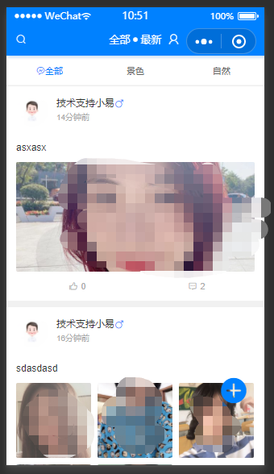
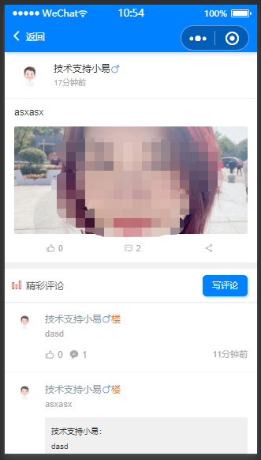
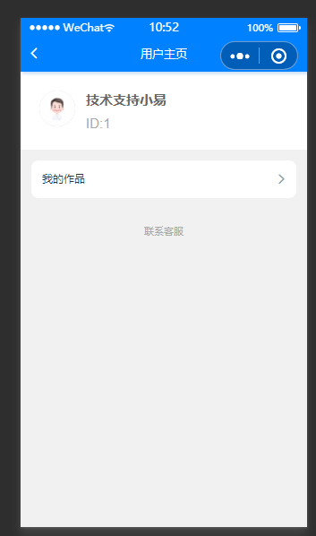
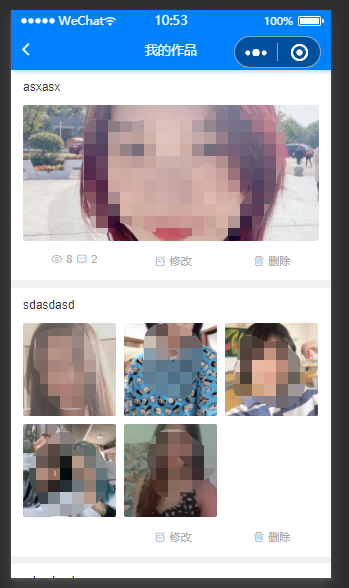

# bbsclient
uniapp bbs client 

## 介绍
基于uni-app开发的开源BBS论坛小程序，使用了ColorUI作为样式框架。

## 开发及部署
拉取代码包，在HbuilderX编辑器载入，修改微信小程序APPID，编译及发布即可。

## 学习资料
https://uniapp.dcloud.io/
https://www.dcloud.io/hbuilderx.html

## 效果预览

 

